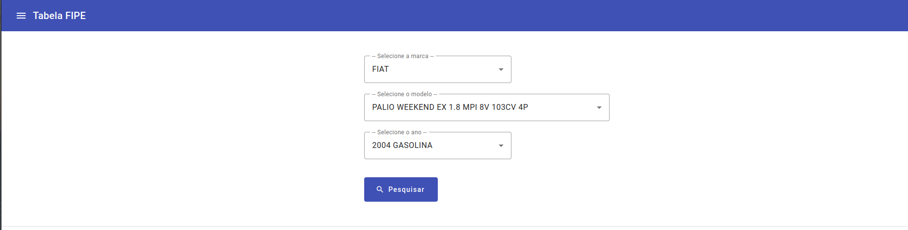

<h1 style="font-weight: bold;">Consulta Tabela FIPE </h1>

<p align="justify">
    A Tabela Fipe expressa preços médios para pagamento à vista, praticados na revenda de veículos para o consumidor final, pessoa física, no mercado nacional, servindo apenas como um parâmetro para negociações ou avaliações. </br> </br> Esse aplicativo disponibiliza um formulário web que pesquisa as informações da tabela, consumindo a api desenvolvida por Deivid Fortuna em https://github.com/deividfortuna/fipe que retorna as informações da tabela.
</p>

<p>
 <a href="#technologies">• Tecnologias</a> </br>  
 <a href="#started">• Instalação</a>  
</p>

<p>
  </br>  
</p>

<h2 id="technologies">💻 Tecnologias utilizadas</h2>

- Angular - v.17
- Angular Material UI - v.17
- Docker - v.24
- Nginx - last version

<h2 id="started">🚀 Instalação</h2>

<h3>Pré-requisitos</h3>

- [Git](https://github.com)
- [Docker](https://www.docker.com/)

<h3>Clonando o projeto</h3>

```bash
git clone https://github.com/renatomdev/consulta-tabela-fipe.git
```

<h3>Rodando o projeto</h3>

```bash
cd consulta-tabela-fipe
docker build -t fipe .
docker run-p 8080:80 fipe
```

